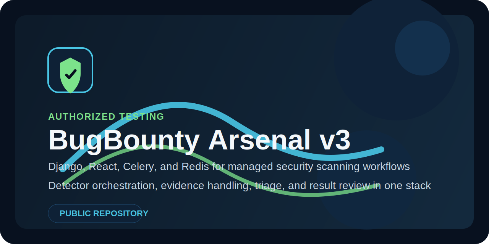
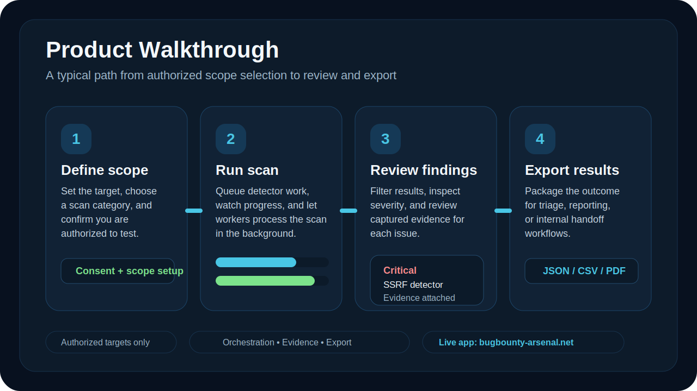

# BugBounty Arsenal v3



[](LICENSE)
[]()
[]()
[]()
[]()

BugBounty Arsenal is a full-stack platform for running authorized web application security scans, collecting evidence, and triaging results from a single interface.

The public edition focuses on development-safe source code. Operational runbooks, environment-specific deployment assets, customer evidence, and private testing material are intentionally excluded.

## What it includes

- Django API and async scan orchestration
- React dashboard for scans, findings, auth, and account flows
- Detector-based scan engine for common web security checks
- Export and evidence handling paths for result review workflows
- Docker-based local development setup

## Product walkthrough



Live links: [Open the live app](https://bugbounty-arsenal.net) · [Latest public release](https://github.com/FoxVR-sudo/Bug-Bounty-Arsenal-v.3/releases/latest)

1. Set the target scope and confirm you are authorized to test it.
2. Start a scan from the dashboard and let the worker pipeline run detectors in the background.
3. Review findings, evidence, and severity data from the results interface.
4. Export the outcome for triage, disclosure, or internal remediation workflows.

### Typical operator flow

- Sign in and configure the target or category you want to assess.
- Launch a scan and monitor progress while Celery workers process the queued tasks.
- Inspect findings, filter noise, and verify the evidence captured for each issue.
- Export the results and hand them off to the next review or reporting step.

## Stack

- Django 6 and Django REST Framework
- React 18, React Query, React Router, Tailwind CSS
- Celery and Redis for async job execution
- SQLite or PostgreSQL-backed persistence
- Docker Compose for local development

## Repository layout

- `config/` settings, ASGI, Celery, middleware, routing
- `detectors/` active and passive detector implementations
- `frontend/` React application and static server
- `scans/` scan models, tasks, APIs, exports, websocket updates
- `subscriptions/` plan and usage management
- `users/` authentication, verification, profile, integrations

## Quick start

```bash
cp .env.example .env
docker compose up --build
docker compose exec web python manage.py migrate
docker compose exec web python manage.py createsuperuser
```

App URLs:

- Frontend: `http://localhost:3000`
- API: `http://localhost:8001/api`

## Local development

### Backend

```bash
python3 -m venv .venv
. .venv/bin/activate
pip install -r requirements.txt
cp .env.example .env
python manage.py migrate
python manage.py runserver 0.0.0.0:8001
```

### Frontend

```bash
cd frontend
npm install
npm start
```

## Public repository scope

This public repository intentionally omits:

- internal runbooks and launch checklists
- evidence and generated scan artifacts
- deployment-only infrastructure files
- local databases, keys, certificates, and editor state
- the private day-to-day test suite used in the source repository

## Safety

Use this project only against systems you own or are explicitly authorized to test.

## License

MIT